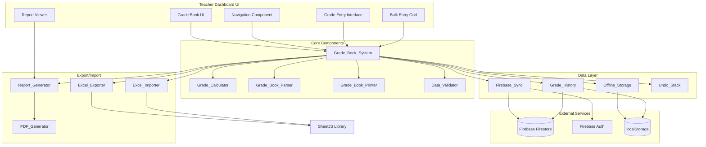
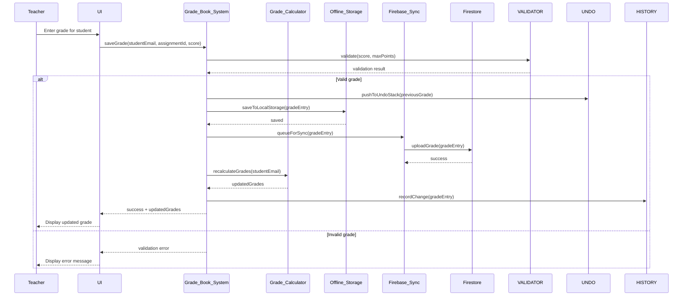

# Design Document: Grade Book System

## Overview

The Grade Book System is a comprehensive grade management solution integrated into the Vision Education teacher portal. The system enables teachers to create assignments, enter grades, calculate weighted averages, generate report cards, and export data to Excel format. The design emphasizes offline-first operation with automatic cloud synchronization, keyboard-driven efficiency, and seamless integration with the existing teacher dashboard infrastructure.

### Key Design Goals

1. **Offline-First Architecture**: Full functionality without network connectivity, with automatic synchronization when online
2. **Performance at Scale**: Support for classes up to 100 students with sub-second response times
3. **Keyboard-Driven Efficiency**: Rapid grade entry using Tab, Enter, and arrow key navigation
4. **Seamless Integration**: Native integration with existing Teacher_Dashboard, Firebase, and authentication systems
5. **Data Integrity**: Comprehensive audit trails, undo/redo support, and conflict resolution
6. **Accessibility**: WCAG 2.1 AA compliance with full keyboard navigation and screen reader support

### Technology Stack

- **Frontend**: Vanilla JavaScript (ES6+), HTML5, CSS3
- **Storage**: Firebase Firestore (cloud), localStorage (offline cache)
- **Excel Processing**: SheetJS (xlsx library) for import/export
- **UI Framework**: Custom CSS matching existing Teacher_Dashboard design system
- **Authentication**: Existing Firebase Auth integration from firebase.js

## Architecture

### System Architecture Diagram



### Data Flow Diagram



### Component Integration with Teacher Dashboard

```mermaid
graph LR
    subgraph "Existing Teacher Dashboard"
        TD_NAV[Dashboard Navigation]
        TD_AUTH[Auth Session]
        TD_FIREBASE[firebase.js]
        TD_STUDENTS[myStudents Array]
        TD_CLASSES[myClasses Array]
    end
    
    subgraph "Grade Book System"
        GB_NAV[Grades Section]
        GB_DATA[Grade Data Manager]
        GB_UI[Grade Book UI]
    end
    
    TD_NAV -->|Add "Grades" nav item| GB_NAV
    TD_AUTH -->|Reuse session| GB_DATA
    TD_FIREBASE -->|Reuse config| GB_DATA
    TD_STUDENTS -->|Student list| GB_UI
    TD_CLASSES -->|Class list| GB_UI
    
    GB_NAV -->|Navigate to grades| GB_UI
    GB_DATA -->|Load/save grades| GB_UI
```

## Components and Interfaces

### 1. Grade_Book_System (Main Controller)

**Responsibility**: Orchestrates all grade book operations, manages state, coordinates between components

**Public Interface**:
```javascript
class GradeBookSystem {
  // Initialization
  constructor(teacherEmail, institutionId)
  async initialize()
  
  // Assignment Management
  async createAssignment(assignment)
  async updateAssignment(assignmentId, updates)
  async deleteAssignment(assignmentId)
  async getAssignments(classId)
  
  // Grade Entry
  async saveGrade(gradeEntry)
  async saveGrades(gradeEntries) // Bulk entry
  async getGrade(studentEmail, assignmentId)
  async getStudentGrades(studentEmail)
  async getAssignmentGrades(assignmentId)
  
  // Weighted Categories
  async createCategory(category)
  async updateCategory(categoryId, updates)
  async deleteCategory(categoryId)
  async getCategories(classId)
  
  // Calculations
  async calculateStudentGrade(studentEmail, classId)
  async calculateClassStatistics(classId)
  
  // History and Undo
  undo()
  redo()
  getGradeHistory(studentEmail, assignmentId)
  
  // Export/Import
  async exportToExcel(classId)
  async importFromExcel(file, classId)
  async exportToJSON(classId)
  async importFromJSON(jsonData, classId)
  
  // Reports
  async generateReportCard(studentEmail, classId)
  async generateClassReport(classId)
  
  // Sync
  async syncToCloud()
  async syncFromCloud()
  getSync