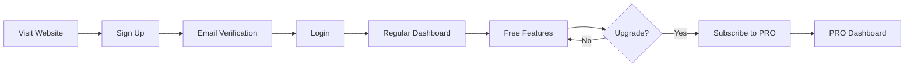
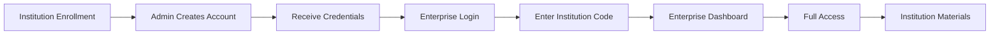

# Dashboard Comparison: Regular vs Enterprise Student

## Overview

This document outlines the key differences between the regular student dashboard and the enterprise student dashboard to help developers and administrators understand the distinct features and use cases.

## Quick Comparison Table

| Feature | Regular Student Dashboard | Enterprise Student Dashboard |
|---------|--------------------------|------------------------------|
| **Access URL** | `/dashboard.html` | `/enterprise-student-dashboard.html` |
| **Login Portal** | `/login.html` | `/enterprise-login.html` |
| **User Role** | `student` or `pro` | `enterprise-student` |
| **Institution Code** | Not required | Required |
| **Branding** | Vision Education only | Institution + Vision Education |
| **Materials** | All public materials | Institution-specific + public |
| **Pricing** | Individual subscription | Institutional license |
| **Support** | Direct to Vision Education | Through institution |
| **Upgrade Options** | Can upgrade to PRO | Managed by institution |
| **Data Isolation** | Personal data only | Institution-scoped data |

## Detailed Comparison

### 1. Authentication & Access

#### Regular Student Dashboard
```javascript
// Login through regular portal
URL: /login.html

// Session structure
{
  email: "student@gmail.com",
  name: "John Doe",
  role: "student", // or "pro"
  provider: "email" // or "google"
}

// No institution code required
// Can sign up independently
```

#### Enterprise Student Dashboard
```javascript
// Login through enterprise portal
URL: /enterprise-login.html

// Session structure
{
  email: "student@school.edu",
  name: "John Doe",
  role: "enterprise-student",
  institutionId: "SCHOOL001",
  institutionName: "Example High School",
  schoolCode: "SCHOOL001",
  provider: "email"
}

// Institution code required
// Account created by institution admin
```

### 2. Visual Branding

#### Regular Student Dashboard
- Vision Education logo and branding
- Standard color scheme (Indigo primary)
- Generic welcome message
- "WASSCE" badge in navigation

```html
<!-- Navigation badge -->
<span class="nav-badge">WASSCE</span>

<!-- Welcome section -->
<h1>Welcome, <span>John</span></h1>
<p>Choose a subject to practice...</p>
```

#### Enterprise Student Dashboard
- Institution logo + Vision Education
- Institution name prominently displayed
- Custom welcome with institution context
- "ENTERPRISE" badge in navigation

```html
<!-- Navigation badge -->
<span class="nav-badge enterprise-badge">ENTERPRISE</span>

<!-- Institution branding -->
<div class="institution-branding">
  <div class="institution-logo">S</div>
  <div class="institution-info">
    <div class="institution-label">Learning with</div>
    <div class="institution-name">Example High School</div>
  </div>
</div>

<!-- Welcome section -->
<h1>Welcome, <span>John</span></h1>
<p>Access your institution's curated learning materials...</p>
```

### 3. Content & Materials

#### Regular Student Dashboard
```javascript
// Shows all public materials
function loadMaterials() {
  const allMaterials = getMaterials();
  // No filtering by institution
  renderMaterials(allMaterials);
}

// Materials section title
"Learner Materials"
"Official study packs, syllabus review guides..."
```

#### Enterprise Student Dashboard
```javascript
// Filters materials by institution
function loadInstitutionMaterials(session) {
  const allMaterials = getMaterials();
  
  // Filter by institution
  const institutionMaterials = allMaterials.filter(m => {
    return m.institutionId === session.institutionId || 
           !m.institutionId; // Include public materials
  });
  
  renderMaterials(institutionMaterials);
}

// Materials section title
"Institution Materials"
"Study resources provided by your institution"
```

### 4. Navigation & Features

#### Regular Student Dashboard

**Side Navigation:**
- Dashboard
- Mock Exams
- Past Questions
- AI Learning Hub
- Vision Blog (external)
- Study Planner
- **Upgrade Button** (prominent)

**Quick Actions:**
- Not present (features in navigation)

**Footer:**
- Privacy Policy
- Terms of Service
- Admin Portal link

#### Enterprise Student Dashboard

**Side Navigation:**
- Dashboard
- Past Questions
- AI Learning Hub
- Mock Exams
- Study Planner
- **No Upgrade Button** (managed by institution)

**Quick Actions:**
- Practice Questions
- Mock Exams
- AI Learning
- Study Planner

**Footer:**
- Enterprise Student Portal branding
- "Managed by your institution"
- Contact school administrator for support

### 5. Subscription & Pricing

#### Regular Student Dashboard
```javascript
// Shows PRO upgrade options
<a href="/pricing" class="nav-get-pro">
  <span>Upgrade to PRO</span>
</a>

// Individual pricing
- Free tier with limited features
- PRO subscription: GHS 30/month
- Can purchase directly
- Paystack integration
```

#### Enterprise Student Dashboard
```javascript
// No upgrade button
// Subscription managed by institution

// Institutional pricing
- Full access included
- No individual payment
- Managed by school admin
- Bulk licensing model
```

### 6. Settings & Preferences

#### Regular Student Dashboard

**Settings Options:**
- Account Profile
- Security & Auth
- Vision PRO Status (subscription management)
- Parent Portal
- WhatsApp Integration
- Password Change
- Device Management

```javascript
// Can manage own subscription
function updateSubscription() {
  // User can upgrade/downgrade
  // Direct payment processing
}
```

#### Enterprise Student Dashboard

**Settings Options:**
- Account Profile (limited)
- Security & Auth
- **No Subscription Management** (grayed out)
- Parent Portal
- WhatsApp Integration
- Password Change (may be restricted)
- Device Management

```javascript
// Subscription managed by institution
function updateSubscription() {
  alert('Subscription managed by your institution. Contact your administrator.');
}
```

### 7. Data & Analytics

#### Regular Student Dashboard
```javascript
// Personal data only
const stats = localStorage.getItem(`waec_stats_${userEmail}`);

// No institution context
// Individual progress tracking
// Personal streak data
```

#### Enterprise Student Dashboard
```javascript
// Personal data + institution context
const stats = localStorage.getItem(`waec_stats_${userEmail}`);

// Institution-scoped data
// May be visible to institution admins
// Aggregated for institution reports
```

### 8. Support & Help

#### Regular Student Dashboard

**Support Channels:**
- Direct email to Vision Education
- In-app chat support
- Help documentation
- Community forum

**Contact:**
- support@visionedu.online
- +233 XX XXX XXXX

#### Enterprise Student Dashboard

**Support Channels:**
- Contact institution administrator first
- Institution IT support
- Escalate to Vision Education if needed
- Institution-specific help docs

**Contact:**
- School administrator
- institutions@visionedu.online (for admins)

### 9. User Journey

#### Regular Student Dashboard



#### Enterprise Student Dashboard



## Use Cases

### When to Use Regular Student Dashboard

✅ **Individual learners**
- Self-paced learning
- Personal subscription
- No institutional affiliation
- Direct payment capability

✅ **Scenarios:**
- Student studying independently
- Homeschool students
- Adult learners
- International students

### When to Use Enterprise Student Dashboard

✅ **Institutional learners**
- Enrolled in a school/institution
- Institution-provided access
- Curated content from teachers
- Bulk licensing

✅ **Scenarios:**
- High school students
- College prep programs
- Training centers
- Educational institutions

## Migration Path

### From Regular to Enterprise

If a regular student joins an institution:

1. **Admin creates enterprise account** with same email
2. **User logs in** through enterprise portal
3. **Data migration** (optional):
   ```javascript
   // Migrate progress data
   const oldStats = localStorage.getItem(`waec_stats_${email}`);
   // Keep existing progress
   ```
4. **Role updated** to `enterprise-student`
5. **Access enterprise dashboard**

### From Enterprise to Regular

If a student leaves an institution:

1. **Admin deactivates** enterprise account
2. **Student can sign up** as regular user
3. **New account** with same email (different role)
4. **Progress starts fresh** (or migrate if needed)

## Technical Implementation

### Routing Logic

```javascript
// In auth.js or dashboard routing
function routeToDashboard(user) {
  if (user.role === 'enterprise-student') {
    return '/enterprise-student-dashboard.html';
  } else if (user.role === 'student' || user.role === 'pro') {
    return '/dashboard.html';
  } else if (user.role === 'enterprise' || user.role === 'teacher') {
    return '/enterprise-dashboard.html';
  } else if (user.role === 'admin') {
    return '/admin.html';
  }
}
```

### Data Filtering

```javascript
// Regular dashboard - no filtering
function getMaterials() {
  return allMaterials;
}

// Enterprise dashboard - institution filtering
function getMaterials(institutionId) {
  return allMaterials.filter(m => 
    m.institutionId === institutionId || 
    !m.institutionId
  );
}
```

## Best Practices

### For Developers

1. **Always check user role** before rendering dashboard
2. **Filter data by institution** for enterprise students
3. **Apply appropriate branding** based on role
4. **Respect data isolation** rules
5. **Test both dashboards** thoroughly

### For Administrators

1. **Use correct portal** for user type
2. **Provide clear instructions** to students
3. **Maintain institution data** accuracy
4. **Monitor usage** and engagement
5. **Provide support** through proper channels

### For Students

1. **Use correct login portal**:
   - Regular: `/login.html`
   - Enterprise: `/enterprise-login.html`
2. **Keep institution code** secure
3. **Contact appropriate support**:
   - Regular: Vision Education
   - Enterprise: School administrator
4. **Understand access level**:
   - Regular: Individual subscription
   - Enterprise: Institutional license

## Conclusion

The two dashboards serve different user segments with tailored experiences:

- **Regular Dashboard**: Individual learners with direct subscriptions
- **Enterprise Dashboard**: Institutional students with managed access

Both provide excellent WASSCE preparation, but with different branding, content access, and support models appropriate to their user base.

---

**Last Updated**: May 2026
**Version**: 1.0.0
