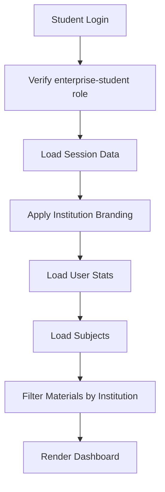

# Enterprise Student Dashboard

## Overview

The Enterprise Student Dashboard is a specialized learning portal designed specifically for students enrolled through educational institutions. It provides a tailored experience with institution-specific branding, curated materials, and proper data isolation.

## Features

### 🏫 Institution Branding
- **Custom Institution Display**: Shows the institution name and logo prominently
- **Enterprise Badge**: Visual indicator that distinguishes enterprise students
- **Institution Context**: All pages reflect the student's institutional affiliation

### 📚 Curated Content
- **Institution Materials**: Access to study resources uploaded by the institution
- **Subject Modules**: WAEC-aligned subjects with practice questions
- **Filtered Content**: Only see materials relevant to your institution

### 📊 Progress Tracking
- **Personal Statistics**: Track questions answered, accuracy, and performance
- **Streak System**: Maintain daily learning streaks with visual feedback
- **Subject-Specific Progress**: Monitor performance across different subjects

### 🎯 Quick Actions
- **Practice Questions**: Direct access to WAEC past questions
- **Mock Exams**: Full-length practice exams
- **AI Learning Hub**: Personalized AI tutoring
- **Study Planner**: Organize study schedules

## File Structure

```
enterprise-student-dashboard.html    # Main HTML structure
enterprise-student-dashboard.js      # Dashboard logic and data loading
enterprise-student-dashboard.css     # Specialized styling
```

## Key Components

### 1. Authentication Guard
```javascript
// Only enterprise-student role can access
if (user.role !== 'enterprise-student') {
  // Redirect to appropriate portal
}
```

### 2. Institution Branding
```javascript
function applyInstitutionBranding(session) {
  // Display institution name
  // Show institution logo
  // Update page title
}
```

### 3. Data Isolation
```javascript
// Filter materials by institution
const institutionMaterials = allMaterials.filter(m => {
  return m.institutionId === session.institutionId;
});
```

### 4. User Interface Sections

#### Hero Section
- Institution branding display
- Personalized welcome message
- Quick stats overview
- Streak widget

#### Quick Actions
- Fast access to key features
- Visual icons for each action
- Hover effects for better UX

#### Subjects Grid
- All WAEC subjects
- Subject-specific icons and colors
- Direct links to practice

#### Institution Materials
- Grouped by subject
- File type indicators
- Download functionality
- "New" badges for recent uploads

## Usage

### For Students

1. **Login**: Use the enterprise login portal at `/enterprise-login.html`
2. **Select Role**: Choose "Enterprise Student"
3. **Enter Credentials**: Use your institution-provided email and password
4. **Institution Code**: Enter your institution's code
5. **Access Dashboard**: You'll be redirected to the enterprise student dashboard

### For Developers

#### Adding New Features

1. **Update HTML**: Add new sections to `enterprise-student-dashboard.html`
2. **Add Logic**: Implement functionality in `enterprise-student-dashboard.js`
3. **Style Components**: Add CSS to `enterprise-student-dashboard.css`

#### Customizing Branding

```javascript
// In enterprise-student-dashboard.js
function applyInstitutionBranding(session) {
  const institutionName = session.institutionName;
  const institutionLogo = session.institutionLogo; // If available
  
  // Apply custom branding
  document.getElementById('institutionName').textContent = institutionName;
  // ... more customization
}
```

#### Adding Material Types

```javascript
// In renderMaterialCard function
const typeColor = {
  PDF: '#ef4444',
  VIDEO: '#f59e0b',
  DOC: '#3b82f6',
  SLIDE: '#8b5cf6',
  LINK: '#10b981',
  AUDIO: '#ec4899',  // Add new type
  // ... more types
};
```

## Data Flow



## Security Features

### Role-Based Access Control
- Only `enterprise-student` role can access
- Automatic redirection for unauthorized users
- Session validation on page load

### Data Isolation
- Materials filtered by `institutionId`
- Students only see their institution's content
- No cross-institution data leakage

### Institution Validation
```javascript
// Verify institution code exists
if (!user.institutionId && !user.schoolCode) {
  alert('Institution information missing');
  window.location.href = '/enterprise-login.html';
}
```

## Styling Guidelines

### Color Scheme
- **Primary**: `#6366f1` (Indigo)
- **Enterprise Green**: `#10b981` (Emerald)
- **Success**: `#22c55e` (Green)
- **Warning**: `#f59e0b` (Amber)
- **Error**: `#ef4444` (Red)

### Typography
- **Font Family**: Outfit (sans-serif)
- **Headings**: 800-900 weight
- **Body**: 400-600 weight
- **Monospace**: JetBrains Mono

### Spacing
- **Section Padding**: `3rem 2rem`
- **Card Padding**: `1.25rem - 2rem`
- **Gap**: `1rem - 2rem`

## Responsive Design

### Breakpoints
- **Desktop**: > 900px (Side navigation visible)
- **Tablet**: 640px - 900px (Bottom navigation)
- **Mobile**: < 640px (Optimized layout)

### Mobile Optimizations
- Bottom navigation bar
- Stacked layouts
- Touch-friendly buttons
- Reduced padding

## Integration Points

### With Existing Systems

1. **Authentication** (`auth.js`)
   - Uses existing session management
   - Validates enterprise-student role
   - Maintains session persistence

2. **Materials System** (`materials.js`)
   - Filters materials by institution
   - Uses existing material structure
   - Supports all material types

3. **Firebase/Firestore**
   - Reads user data from Firestore
   - Respects security rules
   - Maintains data isolation

4. **Theme System** (`theme.js`)
   - Supports light/dark mode
   - Uses CSS variables
   - Consistent with main dashboard

## Future Enhancements

### Planned Features
- [ ] Institution-specific announcements
- [ ] Class/cohort grouping
- [ ] Teacher-student messaging
- [ ] Assignment submissions
- [ ] Grade book integration
- [ ] Parent portal access
- [ ] Attendance tracking
- [ ] Custom institution themes

### Performance Optimizations
- [ ] Lazy loading for materials
- [ ] Image optimization
- [ ] Caching strategies
- [ ] Progressive Web App (PWA) features

## Troubleshooting

### Common Issues

**Issue**: Dashboard not loading
- **Solution**: Check if user has `enterprise-student` role
- **Solution**: Verify `institutionId` exists in session

**Issue**: No materials showing
- **Solution**: Confirm materials have correct `institutionId`
- **Solution**: Check Firestore security rules

**Issue**: Branding not appearing
- **Solution**: Verify `institutionName` in session
- **Solution**: Check `applyInstitutionBranding()` function

### Debug Mode

Enable console logging:
```javascript
console.log('[Enterprise Student] Session:', session);
console.log('[Enterprise Student] Materials:', materials);
```

## Testing

### Manual Testing Checklist
- [ ] Login as enterprise student
- [ ] Verify institution branding appears
- [ ] Check materials are filtered correctly
- [ ] Test all quick action links
- [ ] Verify stats display correctly
- [ ] Test responsive design on mobile
- [ ] Check theme switching
- [ ] Test logout functionality

### Test Accounts
Create test accounts with:
- Role: `enterprise-student`
- Institution ID: `TEST_INSTITUTION_001`
- Institution Name: `Test High School`

## Support

### For Students
Contact your institution's administrator for:
- Login credentials
- Institution code
- Technical support
- Content issues

### For Developers
- Check console for error messages
- Review session data structure
- Verify Firestore rules
- Test with different institutions

## License

This dashboard is part of the Vision Education platform and follows the same licensing terms as the main application.

## Credits

Developed by the Vision Education team for institutional learning excellence.

---

**Last Updated**: May 2026
**Version**: 1.0.0
**Status**: Production Ready
