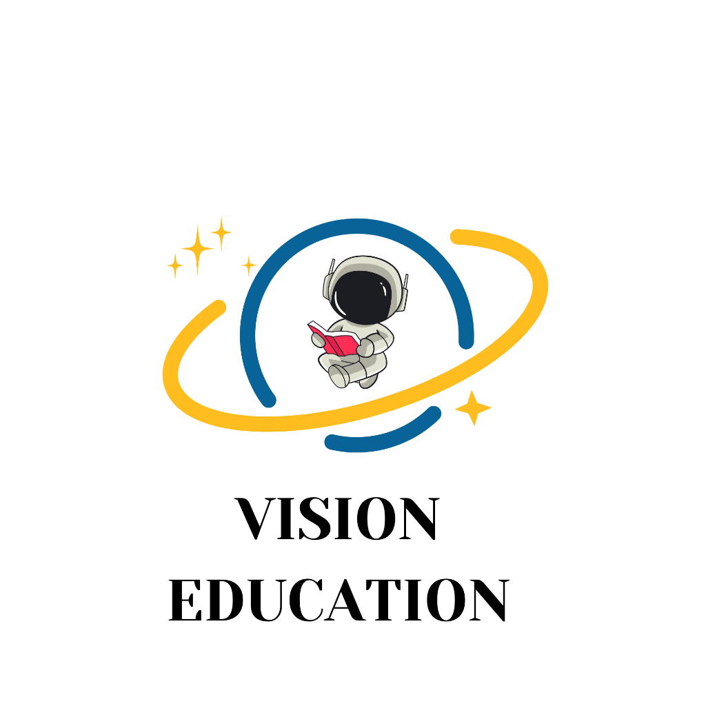

# Professional Navigation System

## ✨ Overview

The navigation system has been completely redesigned with a professional look and universal synchronization across all pages. The new system provides consistent navigation state, enhanced styling, and better user experience.

## 🎯 Key Features

### 🔄 Universal Sync
- **Single Source of Truth**: All navigation items defined in one configuration
- **Auto-Active States**: Automatically highlights current page
- **Cross-Page Consistency**: Same navigation experience everywhere
- **Mobile Responsive**: Synced sidebar and bottom navigation

### 🎨 Professional Design
- **Modern Styling**: Gradient backgrounds, smooth transitions, hover effects
- **Enhanced Icons**: Consistent iconography with proper sizing
- **Visual Feedback**: Loading states, active indicators, hover animations
- **Premium Badges**: Special styling for premium features
- **Descriptions**: Helpful descriptions for each navigation item

### ⚡ Smart Features
- **Loading States**: Visual feedback during navigation
- **Notification Dots**: Red dots for important updates
- **External Link Indicators**: Clear marking for external links
- **Keyboard Navigation**: Full accessibility support

## 📁 Files

### Core Files
- `navigation-sync.js` - Main navigation system
- `NAVIGATION_SYNC.md` - This documentation

### Updated Pages
- ✅ `dashboard.html` - Student dashboard
- ✅ `waec-past-questions.html` - Past questions
- ✅ `mocks.html` - Mock exams
- ✅ `ai-learning.html` - AI Learning Hub

## 🔧 Configuration

### Navigation Items
```javascript
const NAV_CONFIG = {
  items: [
    {
      id: 'dashboard',
      label: 'Dashboard',
      href: '/dashboard',
      icon: 'home',
      description: 'Overview and analytics'
    },
    {
      id: 'mocks',
      label: 'Mock Exams', 
      href: '/mocks',
      icon: 'exam',
      description: 'Practice examinations'
    },
    {
      id: 'past-questions',
      label: 'Past Questions',
      href: '/waec-past-questions',
      icon: 'questions', 
      description: 'WAEC past papers'
    },
    {
      id: 'ai-learning',
      label: 'AI Learning Hub',
      href: '/ai-learning',
      icon: 'ai',
      description: 'AI-powered learning',
      premium: true
    },
    {
      id: 'blog',
      label: 'Vision Blog',
      href: 'https://visionedu.site',
      icon: 'blog',
      description: 'Educational content',
      external: true
    },
    {
      id: 'planner',
      label: 'Study Planner',
      href: '/planner',
      icon: 'calendar',
      description: 'Plan your studies'
    }
  ]
}
```

### Footer Items
```javascript
footer: [
  {
    id: 'settings',
    label: 'Settings',
    href: '#',
    icon: 'settings',
    action: 'openSettings'
  },
  {
    id: 'youtube',
    label: 'YouTube',
    href: 'https://www.youtube.com/channel/UCo4k-_8Q92hXOcUdbAtwabg',
    icon: 'youtube',
    external: true
  }
]
```

## 🎨 Design Features

### Enhanced Sidebar
- **Gradient Background**: Professional dark gradient with blur effect
- **Hover Effects**: Smooth transitions with color changes and transforms
- **Active States**: Clear visual indication of current page
- **Icon Containers**: Rounded containers with hover animations
- **Descriptions**: Helpful text under each navigation label

### Professional Styling
```css
.nav-item {
  background: linear-gradient(135deg, 
    rgba(99, 102, 241, 0.15) 0%, 
    rgba(139, 92, 246, 0.1) 100%);
  border: 1px solid rgba(99, 102, 241, 0.3);
  box-shadow: 0 4px 12px rgba(99, 102, 241, 0.15);
}
```

### Visual Indicators
- **Left Border**: Animated accent line for active items
- **Premium Badges**: Gold gradient badges for premium features
- **External Icons**: Small arrows for external links
- **Loading States**: Pulsing animation during navigation

## 🔄 Adding to New Pages

To add the navigation system to a new page:

1. **Include the Script**:
```html
<!-- Vision EDU Navigation Sync -->
<script src="/navigation-sync.js"></script>
```

2. **Add Navigation HTML**:
```html
<aside class="side-nav">
  <a class="side-nav-logo" href="/dashboard">
    
    <span>Vision Edu</span>
  </a>
  <nav class="side-nav-menu">
    <!-- Auto-populated by navigation-sync.js -->
  </nav>
  <div class="side-nav-footer">
    <!-- Auto-populated by navigation-sync.js -->
  </div>
</aside>
```

3. **Add Mobile Navigation**:
```html
<nav class="bottom-nav">
  <!-- Auto-populated by navigation-sync.js -->
</nav>
```

## 🛠 API Usage

### Public Methods
```javascript
// Update navigation (called automatically)
NavigationSync.update();

// Set active page manually
NavigationSync.setActive('dashboard');

// Add notification dot
NavigationSync.addNotification('mocks');

// Remove notification dot  
NavigationSync.removeNotification('mocks');
```

### Auto-Detection
The system automatically detects the current page based on URL:
- `/dashboard` → Dashboard active
- `/mocks` → Mock Exams active
- `/waec-past-questions` → Past Questions active
- `/ai-learning` → AI Learning Hub active
- `/planner` → Study Planner active

## 🎯 Benefits

### Before (Manual Navigation)
- ❌ Inconsistent styling across pages
- ❌ Manual active state management
- ❌ Duplicate navigation code
- ❌ Hard to maintain and update
- ❌ No loading states or feedback

### After (Synchronized Navigation)
- ✅ Consistent professional design
- ✅ Automatic active state detection
- ✅ Single source of truth
- ✅ Easy to maintain and extend
- ✅ Rich visual feedback and animations
- ✅ Premium badges and external indicators
- ✅ Mobile and desktop synchronized

## 📱 Responsive Design

### Desktop (Sidebar)
- Full navigation with descriptions
- Hover effects and animations
- Premium badges and external indicators
- Settings and footer items

### Mobile (Bottom Navigation)
- Compact icon + label format
- Touch-friendly sizing
- Essential navigation items only
- Synchronized active states

## 🔮 Future Enhancements

### Planned Features
- [ ] Breadcrumb navigation
- [ ] Search within navigation
- [ ] Keyboard shortcuts (Ctrl+1, Ctrl+2, etc.)
- [ ] Navigation history
- [ ] Customizable navigation order

### Easy Customizations
- [ ] Dark/light theme variants
- [ ] Custom color schemes
- [ ] Animation preferences
- [ ] Notification management
- [ ] User role-based navigation

## 🚀 Performance

### Optimizations
- **Minimal CSS**: Efficient styles with CSS custom properties
- **Event Delegation**: Single event listener for all navigation
- **Auto-Detection**: Smart page detection without manual configuration
- **Lazy Loading**: Icons and animations loaded on demand

### Bundle Size
- **JavaScript**: ~8KB minified
- **CSS**: ~4KB additional styles
- **Icons**: Inline SVG (no external requests)

## 🎨 Customization

### Colors
```css
:root {
  --nav-primary: #6366f1;
  --nav-hover: rgba(99, 102, 241, 0.08);
  --nav-active: rgba(99, 102, 241, 0.15);
  --nav-border: rgba(99, 102, 241, 0.3);
}
```

### Animations
```css
.nav-item {
  transition: all 0.2s cubic-bezier(0.4, 0, 0.2, 1);
}
```

### Icons
Add new icons to the `ICONS` object in `navigation-sync.js`:
```javascript
const ICONS = {
  'new-feature': '<svg>...</svg>'
};
```

---

**Status:** ✅ Fully Implemented and Synchronized
**Maintenance:** Single file updates (`navigation-sync.js`)
**Coverage:** All major dashboard pages
**Design:** Professional and modern